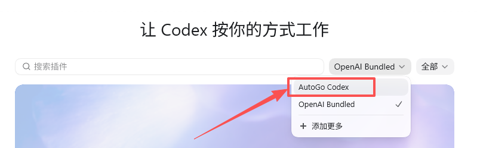
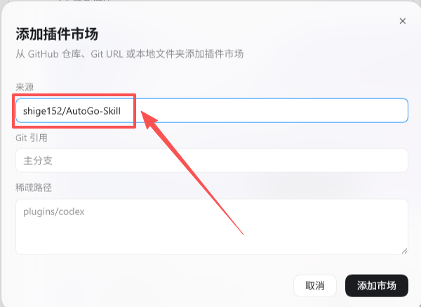
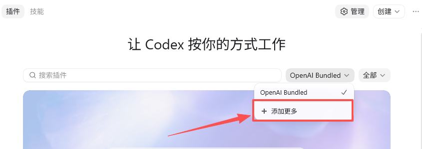
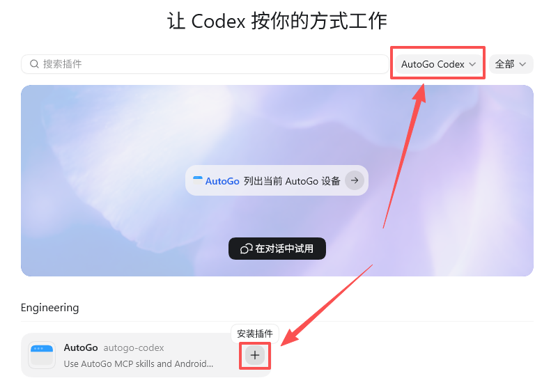

# AutoGo Codex Plugin

这是 AutoGo 的 Codex 插件市场仓库，用于把 AutoGo MCP Server 和相关 Codex Skills 接入 Codex。

## 目录结构

```text
.
├── .agents/plugins/marketplace.json
└── plugins/autogo/
    ├── .codex-plugin/plugin.json
    ├── .mcp.json
    └── skills/autogo*/
```

## 包含内容

- `plugins/autogo/skills/`: AutoGo 相关 Codex Skills
- `plugins/autogo/.codex-plugin/plugin.json`: Codex Plugin manifest
- `plugins/autogo/.mcp.json`: AutoGo MCP Server 配置，使用 `npx -y autogo-mcp`
- `.agents/plugins/marketplace.json`: Codex Plugin Marketplace 配置

## 在 Codex 中添加

在 Codex 的“添加插件市场”窗口中填写：

- 来源：`shige152/AutoGo-Skill`
- Git 引用：留空，或填写 `main`
- 插件路径：留空

也可以使用完整 Git URL：

```text
https://github.com/shige152/AutoGo-Skill.git
```

添加插件市场后，在插件列表中安装或启用 `AutoGo`。

## 安装步骤

1. 打开插件市场下拉菜单，点击“添加更多”。



2. 在“添加插件市场”窗口中输入 `shige152/AutoGo-Skill`，然后点击“添加市场”。



3. 在插件市场下拉菜单中选择 `AutoGo Codex`。



4. 点击 `AutoGo` 插件卡片上的安装按钮。


